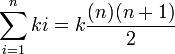

# [Multiples of 3 and 5](http://projecteuler.net/problem=1)
Scott Wiedemann

04/27/2013

## Compile It
cd ./src  
make

## Run It
./multiples

## Thoughts

Use this to find the sum of multiples for 3 and 5.  Remove what is shared in common, multiples of 15, to get an anwser.

## Run-time
O(1)
