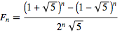
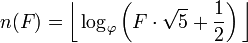
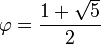
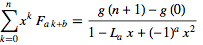
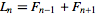
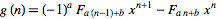

# [Even Fibonacci numbers](http://projecteuler.net/problem=2)
Scott Wiedemann

04/28/2013

## Compile It
cd ./src  
make

## Run It
./evenfib

## Thoughts

Notice that every third number in the Fibonacci sequence is even.

The fibonacci number at index n can be found using the closed form:

The index of a fibonacci number (reverse lookup) can be found using:

where

The closed form for the general summation of the fibonacci sequence is given by:

where lucas number, L, is

and generator, g, is

Consider the summation where:

a = 3

b = 0

x = 1

n = _F_to_i(3999999)/3_

By using the above equations, a closed form can easily be written describing the sum of every third number--every even number--in the sequence up to n.

## Run-time
O(1)
