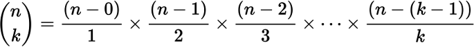

# [Combinatoric selections](http://projecteuler.net/problem=53)
Scott Wiedemann

12/15/2016

## Compile It
ant

## Run It
java -jar ./target/combinatoricselections.jar

## Thoughts
Compute n Choose k term by term:

If at any point during the term multiplication, the result is greater than 1000000, then n choose k is greater than 1000000.  Each term is greater than 1, therefore multiplying the result by an additional term will only increase the result's size.

## Run-time
Unknown.
