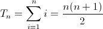

[Highly divisible triangular number](http://projecteuler.net/problem=12)
====================
Scott Wiedemann

12/31/2013

Compile It
----------
ant

Run It
------
./target/hdtn.jar N

Finds the value of the first triangle number to have over N divisors.  N is 500. 

Thoughts
--------

Each triangular number can be written as a simple arithmetic series: 

Notice that n and n+1 are co-prime by definition. gcd(a, b) = 1.  This means the divisors of n/2 are exclusive of the divisors of n+1 when n is even.  (Likewise, when n is odd the divisors of n and (n+1)/2 are exclusive.)  With this insight, the new algorithm runs proportional to the squareroot of the algorithm without the coprime improvement.

Run-time
--------
Unknown.
