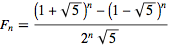
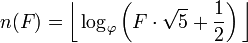
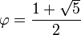
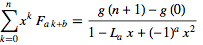
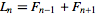
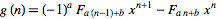

Even Fibonacci numbers
====================
Scott Wiedemann

04/27/2013

Compile It
----------
cd ./src
make

Run It
------
./evenfib

Thoughts
--------

index: 0  1  2  3  4  5  6   7   8   9  10  11   12 ...

F:     0  1  1  2  3  5  8  13  21  34  55  89  144 ...

F%2:   0  1  1  0  1  1  0   1   1   0   1   1    0 ...

Notice that every third number in the Fibonacci sequence is even.

The fibonacci number at index i can be found using the closed form:

The index of a fibonacci number can be found using:

where

The closed form for the general summation of the fibonacci sequence is given by:

where lucas number, L, is

and generator, g, is

Consider the summation where:
a = 3
b = 0
x = 1
n = floor(F_to_i(4*10^6))

By using the above equations, a closed form can easily be written describing the sum of every third number, every even number, in the sequence up to n.

Run-time
--------
O(1)
