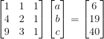
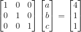
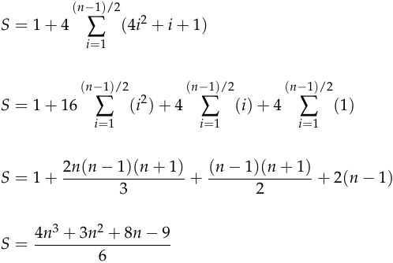

[Number spiral diagonals](http://projecteuler.net/problem=28)
====================
Scott Wiedemann

10/05/2016

Compile It
----------
ant


Run It
------
./target/numberspiraldiagonals.jar 1001

Thoughts
--------

Here is a 9x9 grid:
<pre>
73 74 75 76 77 78 79 80 81
72 43 44 45 46 47 48 49 50
71 42 21 22 23 24 25 26 51
70 41 20  7  8  9 10 27 52
69 40 19  6  1  2 11 28 53
68 39 18  5  4  3 12 29 54
67 38 17 16 15 14 13 30 55
66 37 36 35 34 33 32 31 56
65 64 63 62 61 60 59 58 57
</pre>

Notice that a square grid formed by the spiral will have an odd number of values along one edge.  Then recognize that an mxm grid should have m² entries. (A 9x9 grid will have 9*9 = 81 entries.)

Consider the corner numbers for a certain grid size.  For example the corner numbers for a grid of size 7x7 are 31, 37, 43 and 49.

<pre>
73 74 75 76 77 78 79 80 81
72 <b>43</b> 44 45 46 47 48 <b>49</b> 50
71 42 21 22 23 24 25 26 51
70 41 20  7  8  9 10 27 52
69 40 19  6  1  2 11 28 53
68 39 18  5  4  3 12 29 54
67 38 17 16 15 14 13 30 55
66 <b>37</b> 36 35 34 33 32 <b>31</b> 56
65 64 63 62 61 60 59 58 57
</pre>

These corner numbers are evenly spaced as well (6 apart in this case).  The sum of these numbers is also the sum of the average of these numbers.
<pre>
31 + 37 + 43 + 49 = 160
40 + 40 + 40 + 40 = 160
            4(40) = 160
</pre>

This forulation holds for any mxm spiral grid.  You will notice that the averages for a grid of size m actually appears in the grid; exactly where you would expect them.
<pre>
m:  9  7  5  3  1
   73 74 75 76 77 78 79 80 81
   72 43 44 45 46 47 48 49 50
   71 42 21 22 23 24 25 26 51
   70 41 20  7  8  9 10 27 52
   <b>69</b> <b>40</b> <b>19</b>  <b>6</b>  1  2 11 28 53
   68 39 18  5  4  3 12 29 54
   67 38 17 16 15 14 13 30 55
   66 37 36 35 34 33 32 31 56
   65 64 63 62 61 60 59 58 57
</pre>

So we need some way to generate the avearge based on the grid size.  Instead of using the grid size as an input to the function, let's just use an index.
<pre>
m:  4  3  2  1  0
   73 74 75 76 77 78 79 80 81
   72 43 44 45 46 47 48 49 50
   71 42 21 22 23 24 25 26 51
   70 41 20  7  8  9 10 27 52
   <b>69</b> <b>40</b> <b>19</b>  <b>6</b>  1  2 11 28 53
   68 39 18  5  4  3 12 29 54
   67 38 17 16 15 14 13 30 55
   66 37 36 35 34 33 32 31 56
   65 64 63 62 61 60 59 58 57
</pre>

Grid size to index is a linear relationship: ```m = 2*i + 1```.  It seems like we should be able to describe this pattern using a quadratic equation, after all the second differences (derivative) of the grid size is a constant.

<pre>
grid size:    1    9   25   49   81    ...
diff1:           8   16   24   32   ...
diff2:             8    8    8   ...
</pre>

The equation should have the form:
```
f(i) = a*i² + b*i + c
```
By inspection, we know that:
```
f(1) = 6
f(2) = 19
f(3) = 40
```

With a little linear algebra, we can easily find a, b, and c:





```
f(i) = 4*i² + i + 1
```

Now we can just add up all the terms; for every grid size from 1 to n.

Also add one for the 1 in the center of the grid.



Run-time
--------
O(1)
